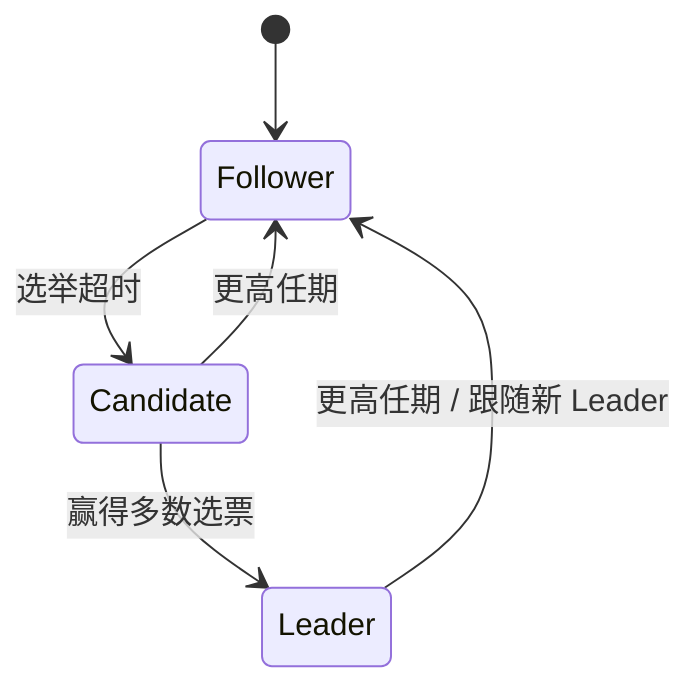

# 2. Raft 状态与状态机变化

本节区分 **Raft 元数据** 与 **业务状态机**，并约定「入队 / 提交 / 应用」与整套文档用语一致。

## 2.1 两套状态不要混

| 层次 | 含义 | 谁维护 |
|------|------|--------|
| **Raft 元数据** | 任期、角色（Follower / Candidate / Leader）、日志条目 `(term, index)`、`commitIndex`、各节点复制进度等 | JRaft |
| **业务状态机** | 业务含义下的领域状态（如内存结构）；由 **对「已提交」日志按序 apply** 得到 | `CodecRaftStateMachine` 及子类逻辑 |

**共识保证的是**：所有存活节点对 **可复制日志里每条命令的内容与顺序** 达成一致；**业务状态** = 对 **同一条日志序列** 做 **确定性** `apply` 的结果。

## 2.2 单条日志条目在状态机视角下的阶段

对索引为 `i` 的一条日志：

| 阶段 | 含义 |
|------|------|
| **未出现** | 任何节点日志中尚无索引 `i`（或尚未稳定追加）。 |
| **已追加、未提交** | 条目已写入部分节点日志，但 Raft **尚未**将该索引标为 **committed**。**正式业务状态**不应依赖「仅追加未提交」的条目作为最终事实。 |
| **已提交（committed）** | 满足 Raft 安全规则后，索引 `i` 被标为已提交；从 **集群语义** 上，该条命令的顺序与内容已 **不可被分叉共识推翻**（在算法假设内）。 |
| **已应用（applied）** | 本节点状态机已 **按序** 执行到索引 `i`，即本节点 **`appliedIndex ≥ i`**。 |

**状态机「变化」**：对 **官方、可对外宣称与日志一致** 的业务状态而言，发生在 **已提交之后** 的 **`StateMachine#onApply`（及本框架里随之触发的 `onRaftLogCommitted` / `RaftApplyMode` 分支）**。

## 2.3 业务状态的归纳定义

设业务状态为 \(S\)，第 \(k\) 条 **已提交** 且轮到本节点 apply 的命令为 \(c_k\)（来自日志字节解码）：

- **初始**：\(S_0\)（空状态，或自快照恢复后的基线）。
- **转移**：\(S_{k} = f(S_{k-1}, c_k)\)，其中 \(f\) 在 **所有节点上必须相同且确定性**，才能保证副本间业务状态一致。

## 2.4 与 `isAccepted`、`RaftApplyMode` 的关系

- **`RaftApplyResult#isAccepted`（入队）**：仅表示 leader 侧 **`Node#apply` 已接收任务**，对应上文 **「已追加」路径的早期**，**不是** committed，**也不是** 状态机已 apply。
- **`AFTER_COMMIT` 下的 `onMessage`**：与 **已提交后再进入状态机回调** 的路径对齐，适合要与 **提交顺序** 一致的业务副作用。
- **`ON_AERON_POLL` 下的 `onMessage`**：在 **入队成功后、commit 完成前** 于 Aeron 线程执行，属于 **产品定义的「早执行」**，**不等价**于上表中的 **「已应用（Raft 语义）」**；若需写 DB / Kafka 作为权威副本，应另行评估幂等与顺序，或改用 **`AFTER_COMMIT`**。

## 2.5 节点角色（简述）

客户端 **`apply` 提案** 由 **Leader** 接收并复制；各节点在 **committed** 前缀上 **按序 apply** 到状态机。单节点部署时仍可有 Leader，只是无多副本网络故事。

---

**上一篇：** [1. 职责划分](./01-overview.md)  
**下一篇：** [3. `onMessage` 与模式](./03-onmessage-and-modes.md)
