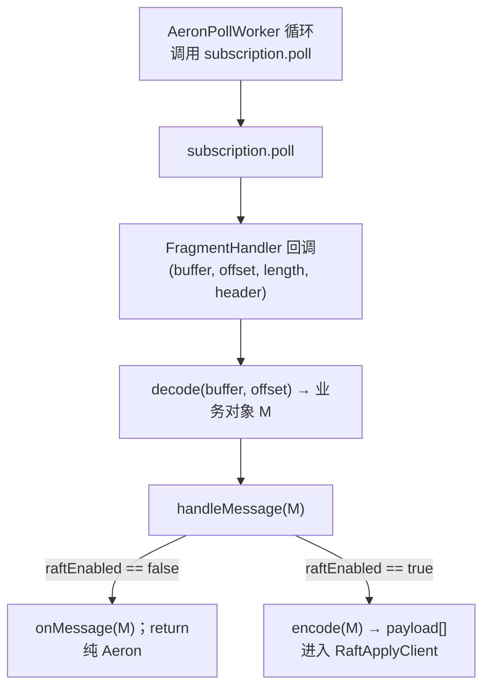
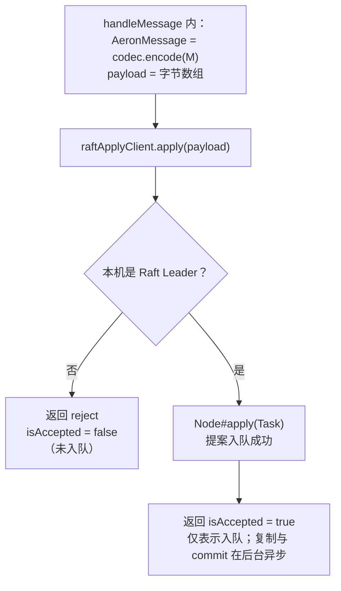
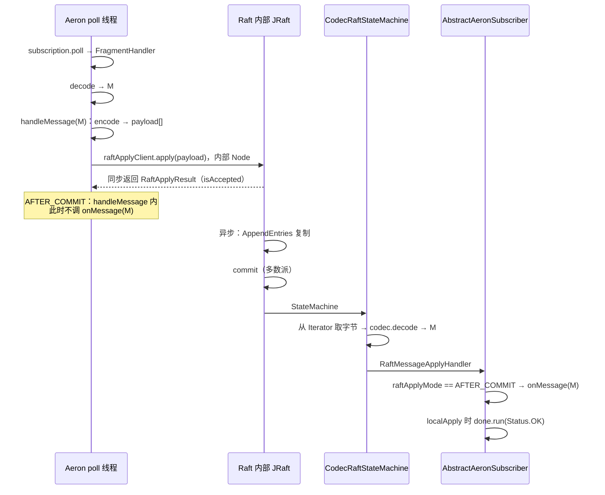
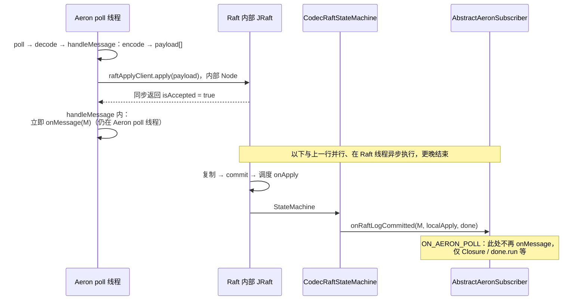
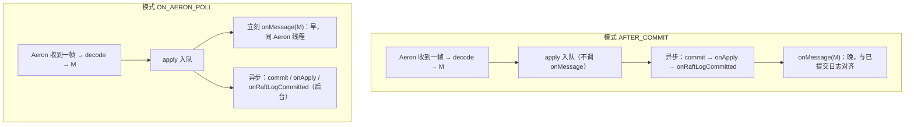

# 5. 端到端调用链（Mermaid）

类名、方法名与 `AbstractAeronSubscriber`、`RaftApplyClient`、`CodecRaftStateMachine` 源码一致；**线程**分为 **Aeron poll 线程**（`AeronPollWorker` 驱动 `subscription.poll`）与 **Raft 内部线程**（JRaft 复制、commit、`StateMachine#onApply`）。下列图在支持 **Mermaid** 的 Markdown 预览中渲染。

## 5.1 直观类比（读图前）

- **Aeron**：像 **快递**，把一帧字节送到本机，`decode` 成业务对象 `M`。
- **Raft**：像 **登记本**，`encode(M)→payload` 后 `Node#apply` 把 **同一条命令** 记入可复制日志；**入队**快，**commit** 与 **状态机 apply** 往往更晚、在别的线程完成。

两种 `RaftApplyMode` 只决定：**业务回调 `onMessage(M)` 是在「登记还没办完」时跑，还是「登记在共识意义上已办完」之后跑。**

## 5.2 公共前半段（两种模式相同）

**发送端（任意进程 → 与 Subscriber 同一 channel + streamId）：**

**接收端（`AbstractAeronSubscriber` 所在 JVM）：**

**入队（`RaftApplyClient#apply`，与两种模式相同）：**

**小结：** Aeron 把一帧变成 `M` 再变成 `payload`；`apply` 对调用线程 **同步返回**。

## 5.3 `RaftApplyMode.AFTER_COMMIT`（时序）

说明：`onApply` 与 `onRaftLogCommitted` 在 **Raft 内部线程**执行；`onMessage` 在 **`onRaftLogCommitted`** 里被调用（与 Aeron poll 线程不同）。

**要点：** `apply` 返回前的步骤在 **Aeron poll 线程**；`onMessage` 在 **commit 之后**、经 **`onRaftLogCommitted`** 触发，**晚于「入队」**。

## 5.4 `RaftApplyMode.ON_AERON_POLL`（时序）

说明：必须先 **`AP->>RJ: apply`**，才有 **`RJ-->>AP: accepted`**；`onMessage` 在 **Aeron poll 线程**、**apply 返回后立刻**调用；Raft 侧 **commit → onApply → onRaftLogCommitted** 仍异步进行，但 **`onRaftLogCommitted` 内不再调 `onMessage`**（仅 `Closure` 等）。

**要点：** **`onMessage` 在「入队返回后立刻」**；**commit → onApply → onRaftLogCommitted** 仍会执行，但业务 **`onMessage` 只走上面一步，不从 `onRaftLogCommitted` 再进**。

## 5.5 两种模式对照表

| 步骤 | `AFTER_COMMIT` | `ON_AERON_POLL` |
|------|----------------|-----------------|
| `handleMessage` 里 `apply` 返回之后 | **不**调 `onMessage` | **若 accepted** 则 **调** `onMessage` |
| `onRaftLogCommitted` 里 | **调** `onMessage` | **不**调 `onMessage`，仅 `Closure` 等 |
| `onMessage` 与 commit 的先后（业务语义） | **晚于** commit | **早于** commit（早执行内存路径） |

## 5.6 时间线对比（只盯 `onMessage`）

---

**上一篇：** [4. 几种「apply」](./04-apply-naming.md)  
**下一篇：** [6. 配置与类索引](./06-config-and-classes.md)
