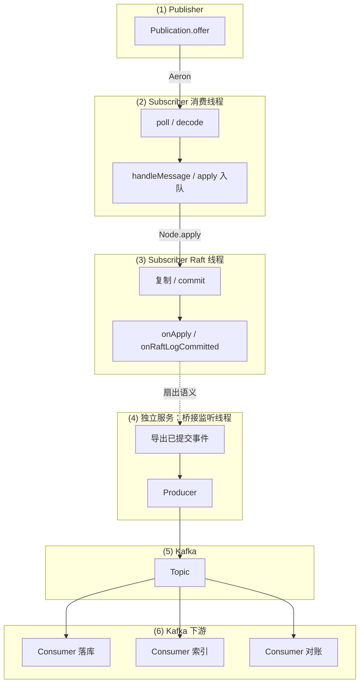

# 8. 六组件架构：Publisher → Subscriber → Raft → 桥接 → Kafka → 下游

**Raft 日志本身不经由 Kafka 复制**；Kafka 承载的是 **「已达成共识之后」要扇出给多个系统的事实或事件**（实现上可由独立进程从 commit/apply 钩子或等价有序流写出）。

## 8.1 总览（Mermaid）

## 8.2 与代码模块的对应关系

| 编号 | 模块 | 典型对应 |
|------|------|----------|
| 1 | Publisher | 各模块里 `Publication`、向 `Constants.AERON_CHANNEL` + `streamId` 发帧 |
| 2 | Subscriber 消费线程 | `AeronPollWorker` + `FragmentHandler` + `handleMessage`（Aeron poll 线程） |
| 3 | Subscriber Raft 线程 | JRaft `Node` 内部线程：`onApply` → `CodecRaftStateMachine` → `onRaftLogCommitted` |
| 4 | 独立服务 + 监听线程 | 例如专用进程内 **Kafka Producer** 线程、或 `sync` 类模块里「commit 后转发」逻辑（实现可替换） |
| 5 | Kafka | 集群 broker + topic |
| 6 | Kafka 下游 | 独立 Spring 服务 / Flink / 对账任务等 **Consumer** |

## 8.3 说明

- **(2) 与 (3)**：在同一 JVM 内通过 **`Node#apply`（同步返回）** 与 **异步 commit/apply** 衔接；图上分框表示 **线程与职责不同**，不是两个进程。
- **(4)**：若放在 **独立进程**，需自行保证 **顺序、幂等与至少一次投递** 与 **Raft 索引或业务序号** 对齐；Kafka 不是 Raft 的复制层，而是 **下游集成层**。

---

**上一篇：** [7. FAQ](./07-faq.md)  
**返回索引：** [README](./README.md)
