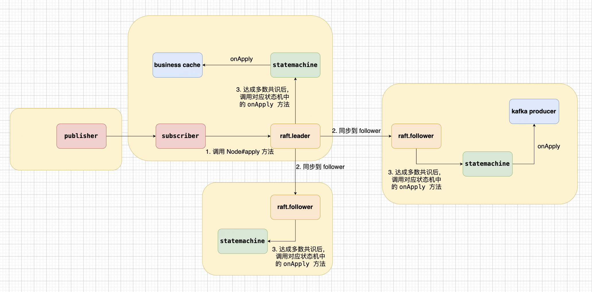

# Raft 流程



## 1、Node#apply(task) 被调用（leader 本机提案入队）

- Leader 收到客户端请求，将待处理的日志条目包装成 Task 提交到 Raft 层
- 如果是 ON_AERON_POLL 模式，那么就是在此时调用 onMessage；
- **调用栈**：`AbstractAeronSubscriber.handleMessage()` → `RaftBootstrap.apply()` → `Node#apply(task)`
- **代码位置**：`RaftBootstrap.java`

```java
public ApplyResult apply(byte[] payload) {
    Task task = new Task();
    task.setData(ByteBuffer.wrap(payload));
    task.setDone(status -> log.info("raft apply callback status={}", status));
    this.getNode().apply(task);
    return ApplyResult.ok();
}
```

## 2、Raft 复制到 follower（协议层）

- Leader 通过网络通信将日志条目复制到所有 Follower 节点
- Follower 接收后写入本地日志，但不/commit
- **代码位置**：JRaft 协议内部实现，由 `RaftBootstrap` 初始化时启动的 JRaft Node 负责

## 3、达到多数后 commit（协议层）

- Leader 确认收到足够多（多数派）的复制确认后
- 将该日志条目标记为已提交（committed）状态
- **代码位置**：JRaft 协议内部实现

## 4、各节点状态机触发 onApply，进入 CodecRaftStateMachine#onApply

- Leader 和 Follower 都会在日志提交后触发状态机应用
- 状态机根据已提交的日志执行实际的业务逻辑
- **调用栈**：JRaft StateMachine → `CodecRaftStateMachine.onApply()` → `applyHandler.onCommitted()`
- **代码位置**：`CodecRaftStateMachine.java`

```java
@Override
public void onApply(Iterator iter) {
    while (iter.hasNext()) {
        ByteBuffer data = iter.getData();
        byte[] bytes = new byte[data.remaining()];
        data.get(bytes);
        M message = codec.decode(new UnsafeBuffer(bytes), 0);

        Closure done = iter.done();
        applyHandler.onCommitted(message, done != null, done);
        iter.next();
    }
}
```

## 5、applyHandler.onCommitted(...) 被调用

- 这是业务层处理已提交日志的回调入口

### 5.1、subscriber 中

在 subscriber 场景里，如果是 AFTER_COMMIT 模式就是 onRaftCommitted，具体逻辑是onMessage，onMessage的具体的实现在subscriber的实现子类中：  
    - 订阅者模式：消息通过 Aeron 订阅通道投递到业务端  
    - **调用栈**：`CodecRaftStateMachine.onApply()` → `AbstractAeronSubscriber.onRaftCommitted()` → `onMessage()`
    - **代码位置**：`AbstractAeronSubscriber.java`

```java
protected void onRaftCommitted(M message, boolean localApply, Closure done) {
    if (properties.getRaftApplyMode() == RaftApplyMode.AFTER_COMMIT) {
        this.onMessage(message);
    }
    if (localApply && done != null) {
        done.run(Status.OK());
    }
}
```

### 5.2、bridge 中

在 bridge 场景里是 RaftKafkaMessageApplyHandler#onCommitted

- 桥接模式：将已提交的日志消息发送到 Kafka
- **调用栈**：`CodecRaftStateMachine.onApply()` → `RaftKafkaMessageApplyHandler.onCommitted()`
- **代码位置**：`RaftKafkaMessageApplyHandler.java`

```java
@Override
public void onCommitted(T message, boolean localApply, Closure done) {
    if (message == null) {
        if (localApply && done != null) {
            done.run(Status.OK());
        }
        return;
    }
    
    final String json;
    try {
        json = objectMapper.writeValueAsString(message);
    } catch (JsonProcessingException e) {
        if (localApply && done != null) {
            done.run(Status.OK());
        }
        return;
    }

    final String key = keyExtractor == null ? null : keyExtractor.apply(message);
    if (key == null) {
        kafkaTemplate.send(topic, json);
    } else {
        kafkaTemplate.send(topic, key, json);
    }

    if (localApply && done != null) {
        done.run(Status.OK());
    }
}
```

